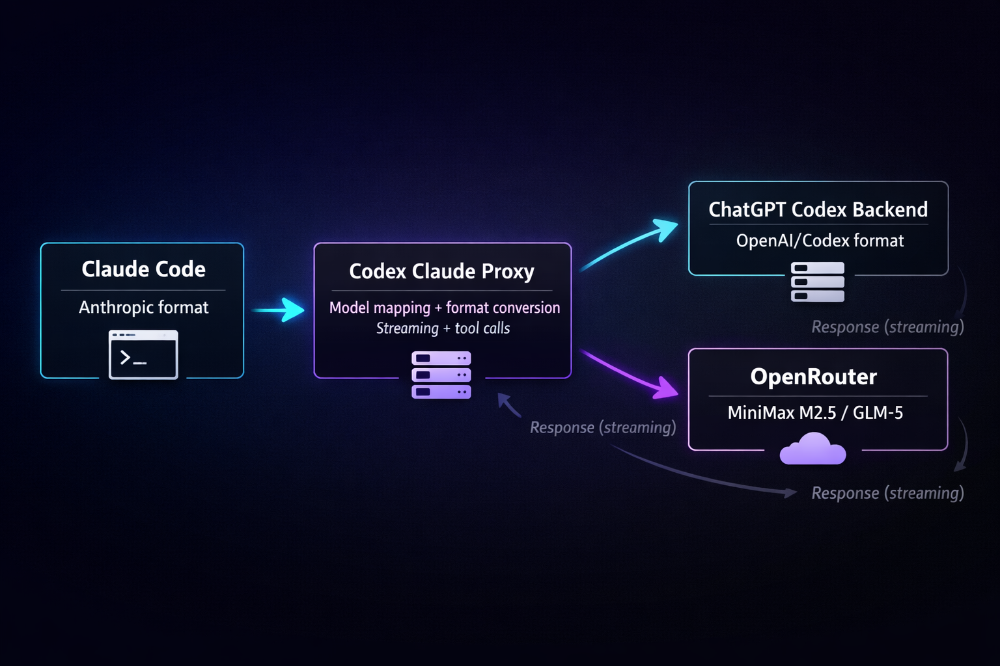

# Codex Claude Proxy



[](https://choosealicense.com/licenses/mit/)
[](https://nodejs.org/)
[](https://github.com/Ayush-Kotlin-Dev/codex-claude-proxy)

> **Use Claude Code CLI with the power of ChatGPT Codex models.**
> A local proxy that translates Anthropic API requests into ChatGPT Codex calls, enabling you to use the `claude` CLI tool with your ChatGPT Free/Plus/Pro subscription.

---

## 🚀 Features

- **Seamless Translation**: Translates Anthropic Messages API calls to ChatGPT Codex format.
- **Model Mapping**: automatically maps `claude-sonnet` and `claude-opus` to their Codex equivalents.
- **Multi-Account Support**: Manage multiple ChatGPT accounts with easy switching and auto-refresh.
- **Web Dashboard**: Built-in UI (`http://localhost:8081`) for managing accounts, viewing logs, and testing prompts.
- **Streaming Support**: Full Server-Sent Events (SSE) support for real-time responses.
- **Native Tool Calling**: Supports Claude's tool use capabilities by translating them to Codex function calls.

---

## � Security & Privacy

**Is this a malicious proxy? No.**

- **Local Execution**: This server runs entirely on your local machine (`localhost`).
- **Direct Communication**: It connects *directly* to OpenAI/ChatGPT endpoints. No data is sent to any third-party server.
- **Open Source**: The full source code is available here for you to audit.
- **No Data Collection**: We do not track your prompts, keys, or personal data.

---

## ⚙️ How it works

This tool acts as a "translation layer" between the Claude CLI and ChatGPT's Codex backend.

1.  **Intercept**: Claude Code CLI sends a request to `localhost:8081` (thinking it's Anthropic's API).
2.  **Translate**: The proxy converts the Anthropic-format JSON into the specific payload format required by ChatGPT's internal Codex API.
3.  **Forward**: The request is sent securely to ChatGPT using your own authenticated session.
4.  **Stream**: The response from ChatGPT is converted back into Anthropic's Server-Sent Events (SSE) format and streamed to your terminal.

```
┌──────────────────┐     ┌─────────────────────┐     ┌────────────────────────────┐
│   Claude Code    │────▶│  This Proxy Server  │────▶│  ChatGPT Codex Backend API  │
│ (Anthropic API)  │     │ (Anthropic ⇄ OpenAI)│     │ (codex/responses)           │
└──────────────────┘     └─────────────────────┘     └────────────────────────────┘
```

---

## �📦 Installation

You don't need to install anything if you just want to run it:

```bash
# Run directly with npx
npx codex-claude-proxy@latest start
```

Or install globally to use the CLI commands anywhere:

```bash
npm install -g codex-claude-proxy
codex-claude-proxy start
```

---

## 🚦 Quick Start

### 1. Start the Proxy

```bash
npx codex-claude-proxy@latest start
```
The server will start at `http://localhost:8081`.

### 2. Add Your Account

#### **Option A: Web Dashboard (Local Desktop)**

1. Open the dashboard at **[http://localhost:8081](http://localhost:8081)**
2. Go to the **Accounts** tab
3. Click **Add Account** and login with your ChatGPT account

#### **Option B: CLI (Desktop or Headless/VM)**

```bash
# Desktop (opens browser)
codex-claude-proxy accounts add

# Headless/VM server (manual code input)
codex-claude-proxy accounts add --no-browser
```

For **headless/VM servers** without a browser:
1. Run the command with `--no-browser`
2. It will print a URL - copy and open it on a device with a browser
3. Complete login on that device
4. After redirect, copy the callback URL (or just the code)
5. Paste it back in the terminal

### 3. Configure Claude Code
   Run this command to automatically configure your `claude` CLI to use the proxy:
   ```bash
   curl -X POST http://localhost:8081/claude/config/proxy
   ```

   *Alternatively, set the environment variables manually:*
   ```bash
   export ANTHROPIC_BASE_URL=http://localhost:8081
   export ANTHROPIC_API_KEY=dummy-key # The key is ignored but required by the CLI
   ```

4. **Run Claude**:
   ```bash
   claude
   ```

---

## 🧠 Model Mapping

The proxy automatically maps Claude model names to the appropriate Codex backend:
(You can Change Models from )

| Claude Model ID | Mapped Codex Model | Auth Required | Description |
| :--- | :--- | :---: | :--- |
| `claude-sonnet-4-5` | **GPT-5.2 Codex** | ✅ | Default high-intelligence model |
| `claude-opus-4-5` | **GPT-5.3 Codex** | ✅ | Maximum reasoning capability |
| `claude-haiku-4` | **GLM-5 / MiniMax** | ❌ | Free tier / routed via OpenRouter (No auth needed) |

---

## 🛠️ Configuration & API

### Web Dashboard
Visit `http://localhost:8081` to:
- **Manage Accounts**: Add, remove, or switch active ChatGPT accounts.
- **View Logs**: See real-time request/response logs for debugging.
- **Test Models**: Run quick tests against the configured models.

### API Endpoints
- `GET /health`: Check server status.
- `GET /accounts`: List configured accounts.
- `POST /v1/messages`: Anthropic-compatible chat completion endpoint.

See [API Documentation](./docs/API.md) for full details.

---

## 🤝 Contributing

Contributions are welcome! Please feel free to submit a Pull Request.

1. Fork the repository
2. Create your feature branch (`git checkout -b feature/AmazingFeature`)
3. Commit your changes (`git commit -m 'Add some AmazingFeature'`)
4. Push to the branch (`git push origin feature/AmazingFeature`)
5. Open a Pull Request

---

## 📄 License
This project is licensed under the MIT License - see the [LICENSE](LICENSE) file for details.

## ⚠️ Disclaimer
This project is an independent open-source tool and is not affiliated with, endorsed by, or sponsored by Anthropic or OpenAI. "Claude" is a trademark of Anthropic PBC. "ChatGPT" and "Codex" are trademarks of OpenAI. Use responsibly and in accordance with applicable Terms of Service.

---

<div align="center">
  <p>If you find this project useful, please give it a star! ⭐️</p>
  <a href="https://github.com/Ayush-Kotlin-Dev/codex-claude-proxy">
    
  </a>
</div>